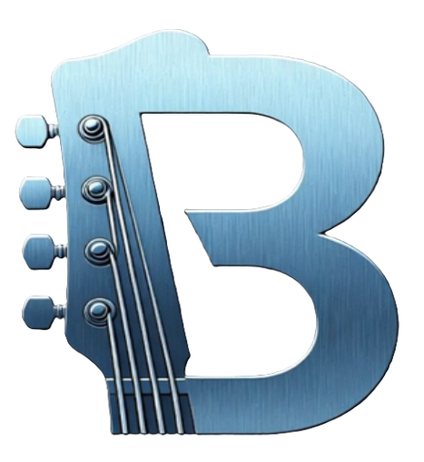

# BlueSteel Guitar Amp Modeler

<p align="center">
  
</p>

<p align="center">
  A full-featured guitar amp modeler and effects processor for Windows.<br>
  Brushed-metal hardware UI · Marantz-style blue VU meters · Zero-latency cab IR convolution
</p>

---

## Features

| Section | Description |
|---|---|
| **Noise Gate** | Threshold / attack / hold / release — silences hum between notes |
| **Power Metal Distortion** | High-gain two-stage amp distortion with Drive, Tone, Tight, Level |
| **Phaser** | Four-stage all-pass phaser (MXR Phase 90 style) |
| **Tape Echo** | Tape delay with wow/flutter pitch modulation |
| **Preamp** | Gain + 3-band EQ (Bass / Mid / Treble) |
| **Power Amp** | Presence filter + Master volume |
| **Cabinet Simulator** | Zero-latency IR convolution — load any WAV or AIFF cabinet IR |
| **Reverb** | Stereo Freeverb room/hall with Mix, Size, Damp, Width |
| **Chromatic Tuner** | NSDF pitch detection, ±cents display, green when in tune |
| **Backing Track Player** | MP3 / WAV / FLAC / AIFF / OGG playback mixed into stereo output |
| **VU Meters** | Dual-channel Marantz-style blue LED bar meters with peak hold |
| **Bypass Buttons** | Per-section ON / BYP toggles on every effect |

### Signal Chain

```
Guitar Input
    │
    ├──► Chromatic Tuner (reads raw signal only)
    ▼
[NOISE GATE] → [DISTORTION] → [PREAMP / EQ] → [PRESENCE]
    ▼
[PHASER] → [TAPE ECHO] → [CAB SIM] → [REVERB] → [MASTER]
    ▼
Stereo Output  ◄── Backing Track mixed in
```

---

## Building

**Requirements**
- Windows 10 / 11 (64-bit)
- [CMake](https://cmake.org/download/) 3.22+
- Visual Studio 2022 (Community edition is free)
- Git (for FetchContent to download JUCE automatically)

**Build steps**

```bat
git clone https://github.com/YOUR_USERNAME/bluesteel.git
cd bluesteel
build.bat
```

The first run downloads JUCE (~200 MB). Subsequent builds are fast.

The executable lands at:
```
build\GuitarAmp_artefacts\Release\Guitar Amp.exe
```

**Optional — ASIO support**

For the lowest possible latency, supply the [Steinberg ASIO SDK](https://www.steinberg.net/developers/):

```bat
cmake -S . -B build -G "Visual Studio 17 2022" -A x64 ^
      -DASIO_SDK_DIR="C:\SDKs\ASIOSDK2.3"
cmake --build build --config Release
```

Without the SDK the app still works using WASAPI (Exclusive mode recommended).

---

## Audio Setup

1. Run `Guitar Amp.exe`
2. Click **AUDIO SETTINGS** (top-right)
3. Select your audio interface and sample rate (44100 or 48000 Hz)
4. Set buffer size — 64–128 samples is ideal for live playing
5. Plug guitar into input, monitors/headphones into output — play

**Latency targets**

| Buffer | Approx. latency | Suitable for |
|---|---|---|
| 64 samples | ~1.5 ms | Live performance |
| 128 samples | ~3 ms | Practice / recording |
| 256 samples | ~6 ms | Casual use |

---

## Cabinet IRs

The cab sim accepts any standard WAV or AIFF impulse response. Free sources:

- **Celestion** — celestion.com (free speaker IRs with registration)
- **OwnHammer** — ownhammer.com (free IR packs)
- **God's Cab** — widely shared free community IR pack
- **Rosen Digital** — modern free pack

Load an IR with **LOAD IR**, then enable **CAB: ON**. BLEND at 100% is full cab colouring; lower values blend in dry signal.

---

## Using Bypass Buttons

Every effect section has a small **ON / BYP** toggle in the top-right corner of its panel. Click it to bypass that stage entirely — the audio thread skips all processing for that section with zero overhead. Useful for A/B comparisons or building a patch incrementally.

The Cabinet Simulator and Tuner have their own dedicated enable buttons.

---

## VU Meters

The header displays dual-channel Marantz-style blue LED bar meters tracking the final stereo output:

- **Segments**: 43 per channel (1 dB each, −40 to +3 VU)
- **Zone colours**: Royal blue → sky blue → cyan (−3 dB) → red (clip)
- **Peak hold**: bright white tick holds 2 seconds, then falls at ~2 dB/s
- **Ballistics**: fast attack, VU-style slower release

---

## Documentation

Full knob-by-knob reference, tone recipes, and troubleshooting: **[USAGE.md](USAGE.md)**

---

## License

MIT — see [LICENSE](LICENSE) for details.
